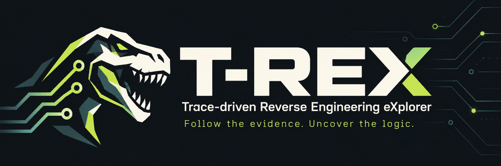

# T-REX

*Follow the evidence. Uncover the logic.*

[](skills/reverse-engineering-investigator/CHANGELOG.md)
[](https://github.com/xxmisaoxx/t-rex/actions/workflows/validate.yml)
[](LICENSE)

[Install](#quick-start) · [Try an example](examples/retry-policy/README.md) · [Getting started](docs/getting-started.md) · [Validation](skills/reverse-engineering-investigator/VALIDATION-RESULTS.md)

T-REX is a reverse-engineering skill for OpenCode, Claude Code, Codex, Cursor, Antigravity, Pi, and other coding agents. It helps agents trace values and callers, investigate initialization, follow connections between native and managed code, and compare software builds using the analysis tools available in your environment.

Its focus is keeping an investigation usable across long sessions. Findings retain their supporting evidence, artifact revisions, and unresolved questions. Checkpoints record the exact next step so another session or agent can continue. Adaptive context handling, dependency checks, and tool-failure recovery help the agent avoid repeated work and identify conclusions that need revalidation.

## Quick start

Run this from your project directory with Node.js, npm and Git available:

```sh
npx skills add xxmisaoxx/t-rex --skill reverse-engineering-investigator
```

The [Skills CLI](https://github.com/vercel-labs/skills) installs the complete skill for supported agents. Choose your agents when prompted. For Claude Code specifically:

```sh
npx skills add xxmisaoxx/t-rex --skill reverse-engineering-investigator --agent claude-code
```

Then ask your agent:

```text
Use the reverse-engineering-investigator skill to investigate <target path>.
Find where <value or behavior> comes from. Show the evidence and unresolved
questions, and save a checkpoint with the exact next step.
```

T-REX is the project name; `reverse-engineering-investigator` is the installed skill name. If your host does not discover it, explicitly ask the agent to read its installed `SKILL.md`.

Prefer manual installation? Copy the complete [skill directory](skills/reverse-engineering-investigator) into your host's skill folder. [Installation paths and troubleshooting](docs/getting-started.md) cover OpenCode, Claude Code, Codex, Cursor, Antigravity and Pi. Python is optional unless you use the helper scripts.

## Try it on a small target

The [retry-policy example](examples/retry-policy/README.md) gives you a short C program, two prompts for starting and resuming an investigation, and an answer you can check. You can inspect the source directly; a compiler is optional.

For your own targets, start with one question:

- Trace a configuration value back to its writers and initialization.
- Find the dispatch or registration path behind an indirect call.
- Follow an Electron IPC handler into a native addon, or a managed call into native code.
- Compare two builds and identify which earlier findings need revalidation.

## What you get

| When an investigation gets difficult | How T-REX helps |
| --- | --- |
| A session compacts or you change agents | Recover the active question, evidence and exact next operation from saved state. |
| A tool report looks convincing but incomplete | Record observation, deduction and interpretation separately, with coverage and limitations. |
| A target is rebuilt or replaced | Bind findings to artifact revisions and revalidate affected conclusions. |
| A provider hangs or reports conflicting results | Preserve partial results and choose a smaller probe that can resolve the uncertainty. |
| Context is running out | Estimate the next operation against actual remaining headroom and checkpoint when needed. |

Profiles cover PE, ELF, Mach-O, generic native code, .NET, JVM, JavaScript/Electron, packaged Python, Android, iOS and WebAssembly. They guide the agent's reasoning; your environment supplies the analysis tools.

The workflow uses the agent's available tools and can work alongside MCP-based analysis systems. The [architecture notes](skills/reverse-engineering-investigator/V3-ARCHITECTURE.md) explain state ownership and evidence dependencies.

## Tested scope

Release 3.1 passed 39 state tests, 20 portability tests covering 17 host/scope layouts, and three fresh-agent source/state continuation cases. [Read the results and remaining gaps](skills/reverse-engineering-investigator/VALIDATION-RESULTS.md).

These checks cover state mechanics and the tested packaging/continuation cases. Actual discovery, compaction and native session lifecycle on every named host, real binary coverage and multi-hour stability still need evaluation.

## Help improve T-REX

[Report a problem](https://github.com/xxmisaoxx/t-rex/issues/new/choose), share a reproducible investigation, or contribute a host fix. [Contributing](CONTRIBUTING.md) explains what information helps.

If T-REX helps your work, star the repository so you can find it again and others can discover it.

## License

Copyright (c) 2026 xxmisaoxx. [GNU GPL version 3 only](LICENSE) (`GPL-3.0-only`).

Commercial use is allowed under the license terms. Redistribution of covered modified works must meet GPLv3's source and notice requirements. The project comes without warranty.
