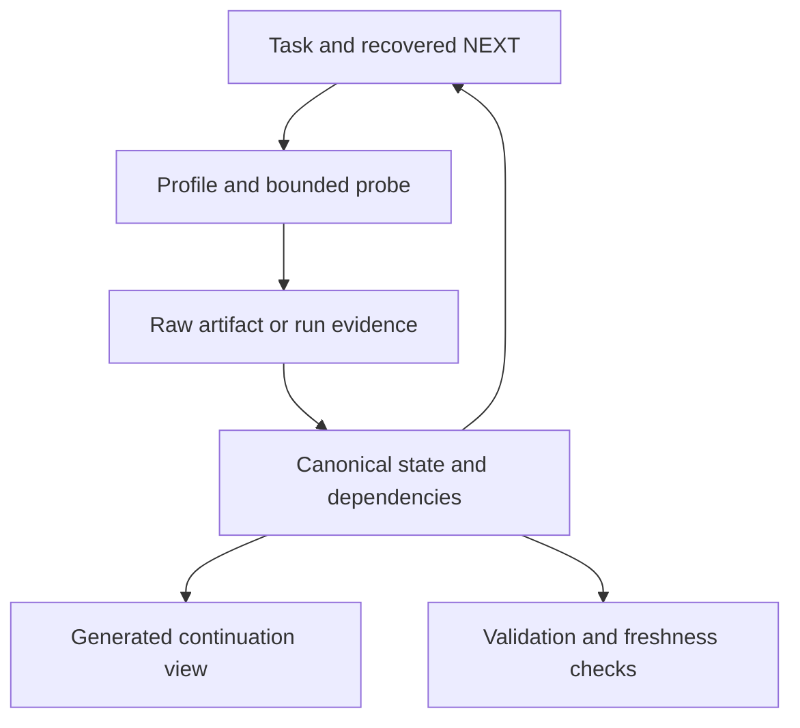

# V3 architecture and feature decisions

## v3.1 host portability extension
Keep one core and canonical schema 3.0. Host adapters and registry describe documented discovery paths, invocation and scope caveats; they contain no target facts and do not prescribe an analysis provider. The exporter verifies manifest bytes and stages one complete core in a host-specific layout. A generic pointer supports explicit instruction loading without claiming universal autoload. Optional reset-context discards transient measurement estimates on host/model/session changes while preserving the evidence graph and NEXT. Capability discovery stays lazy and probe-driven; host features are usable when exposed, never mandatory. The portability contract covers separate resource roots, workspace relocation, writer ownership, host-local jobs and recovery. Installed-product lifecycle validation is independent of packaging and simulated capability tests.

## Gate and aim

Start from validated v2.1, not a rewrite of v2. Baseline checks: manifest/link/template structure passes; four malformed state examples are rejected; frontmatter validator passes. A separate agent used v2.1 without seeing eval rubrics and correctly handled PE raw versus virtual-tail mapping, TLS initialization, exact resume after prompt re-paste, and 1M/780k headroom. These are bounded synthetic task results, not actual OpenCode production runs.

V3 solves contradictory state, dependency freshness and repeated-probe recovery. It does not promise a universal RE engine. The methodology remains provider-neutral and target-independent.

## Components and ownership

| Component | Owns | Load/use trigger |
|---|---|---|
| SKILL.md | Recovery order, probe loop, module entry points | Skill activation |
| Profiles | Format/runtime identities and concrete bridges | New target or reached bridge |
| Shared references | Domain-specific reasoning and context/error decisions | Relevant uncertainty |
| INVESTIGATION.json | Objective, immutable artifact revisions, claims/dependencies, questions, hypotheses, probes, NEXT, context telemetry | Narrow recovery and checkpoint |
| Target map JSON | Address layout bound to revision; evidence-ID links | Conversion/provenance needs |
| Raw evidence files | Byte slices, traces, provider reports | Exact reasoning/reproduction |
| CURRENT-STATE / EVIDENCE-LEDGER | Generated views of canonical state | Human review or compact recovery |
| Optional local helper | Validation, deterministic view/budget, dependency invalidation and revision transition | State maintenance/error prevention |
| Evals/release docs | Scenario rubrics, validation evidence, migration | Release evaluation, not runtime |

Use a small adjacency graph in JSON, not a service or graph database. IDs survive model changes; a revision ID is immutable and a path can be reused by a new revision. Class, confidence and validity are separate fields. Runtime and provider observations have explicit boundaries and coverage. Negative claims carry their searched scope. Derived/inferred claims require dependencies. No claim is promoted automatically.

The optional helper is dependency-free and does not execute target binaries, discover installed tools, call RE providers, generate patches or invoke model APIs. Its implemented schema vocabulary is explicit and fails on unknown validation keywords. JSON Schema documents remain usable by external validators. Helper decisions are deterministic mechanics, never proof that a target interpretation is true.

## Feature evaluation

Context/maintenance costs below are qualitative estimates; no measured token/latency savings are claimed. Every P0 must have a concrete implementation or explicitly bounded policy. P1/P2 are deferred unless noted.

| Candidate | Class | Problem / benefit | Complexity; context; maintenance / confusion | Placement / decision |
|---|---|---|---|---|
| Automatic capability discovery | P1 | Avoid failed provider operations | Medium; potentially broad; API churn | Lazy on-demand capability notes, not an automatic scan engine |
| Automatic profile detection | P1 | Faster routing | Medium; false mixed/packed classifications | Keep evidence-based manual routing; detector external later |
| Multi-profile composition | P0 | Real managed/native boundaries | Low; only relevant profiles; low | Profile rules and binding records |
| Investigation graph | P0 | Canonical question/hypothesis/NEXT links | Medium; narrow slices; low | JSON ID references and checks |
| Evidence graph | P0 | Trace conclusions to source | Medium; avoids duplicate prose; medium | Typed claims + dependency adjacency |
| Selective evidence invalidation | P0 | Prevent stale dependent conclusions | Medium; small outputs; medium | Explicit roots + transitive closure; broad revision change is conservative |
| Region/function fingerprints | P1 | Cheap candidate reuse | Medium; bounds can mislead; medium | Optional raw-range fingerprints/recipes allowed; no automatic semantic reuse |
| Artifact lineage | P0 | Patch/replacement identity | Low; compact revisions; low | Parent/change metadata and advance helper |
| Probe planner | P0 | Concrete executable NEXT | Low; compact; low | Question/capability/scope/discriminator/fallback fields and qualitative scheduling |
| Information-gain scoring | REJECT | Numerical ranking appears objective without calibrated probabilities | High; ceremonial; high | Retain qualitative discriminator/cost/novelty |
| Static-to-dynamic experiment planner | P1 | Resolve actual targets/writers | Medium; conditional; medium | Existing runtime module plus recipe; no specialized planner engine |
| Stale-analysis detection | P0 | Catch wrong revision and byte disagreement | Medium; narrow; medium | Revision binding, file fingerprint checks and dependency validity; no decoder engine |
| Tool/evidence authority model | P0 | Resolve provider disagreement | Low; conditional; low | Claim-specific domains and coverage, no hard provider ranking |
| Anti-loop watchdog | P0 | Avoid repeat hangs/low novelty after resume | Low; compact probe history; low | Probe signatures/outcomes/retry condition plus advisory saturation report |
| Cross-version identity mapping | P2 | Faster version diffs | High; ambiguity; high | Candidate matching policy only; external matching engine later |
| Confidence decay | REJECT | Time is not evidence of invalidity | Medium; false precision; medium | Explicit dependency/artifact/environment invalidation |
| Evidence garbage collection | REJECT | Uncontrolled deletion breaks reproduction | Medium; archive risk; medium | Archive views and raw payload links; user-managed retention |
| Reproduction recipes | P0 | Another model can repeat decisive evidence | Low; short references; low | Structured provider operation, parameters, payload path and boundary |
| Extension API | P2 | Future providers/state services | High; premature contract; high | Stable JSON contract is sufficient now |
| Machine-readable findings | P0 | Reliable state/views/integration | Medium; replaces duplicate facts; medium | Canonical evidence records; report is a view |
| Resume integrity checks | P0 | Exact continuation after interruption | Medium; bounded; low | Schema/references/cycles/NEXT checks, atomic revisioned writes, fingerprint option |

## Context and execution

Use C-U versus N+F+M, with F bounded to the next useful checkpoint and M reflecting uncertainty/output costs. Ratio alone never triggers compaction. Missing telemetry remains unknown; a model switch invalidates old telemetry. Checkpoint before risky state changes, independently of compaction. Summarize duplicate/transient context, preserve unresolved exact data, narrow the next query before compacting. The helper recommends actions; OpenCode controls actual auto-compaction.

Probe history stores signature, outcome, novelty and retry condition. Two comparable no-novelty probes trigger strategy review, not automatic task termination. A blocked or saturated question can yield to another viable question. Tool failure does not refute target hypotheses. Capabilities are chosen for the question and discovered lazily, with no provider requirement.

## Freshness and concurrent writes

Canonical state is one JSON snapshot. Validate before atomic replacement; enforce an expected checkpoint revision and an exclusive short-lived writer lock. A leftover lock is surfaced for owner review; it is not silently deleted. Readers never accept malformed/dangling/cyclic state. Generated views name the canonical checkpoint and can be replaced independently.

`invalidate` marks a supplied E-ID and its dependent closure stale. `advance` creates a new immutable revision from current file bytes, records lineage with mapping-change uncertainty, makes all old-revision evidence historical, and marks dependent conclusions stale; unrelated artifact evidence remains current. This conservative transition does not pretend a byte-range fingerprint proves a global negative or unchanged CFG. Revalidation produces new claim IDs on the new revision; old facts are never rebound silently. An unchanged file check is scoped to bytes/size, not runtime environment.

## Acceptance and limits

Validate template schemas and graph invariants; test helper mutations, conflicts, cycles, transitions and budgets; run the 20 scenario tasks with hidden rubrics and inspect actual responses. Retain raw output and scores. No keywords-only pass and no claim that synthetic decisions prove Windows/JNI execution.

Not implemented: actual OpenCode lifecycle integration, provider adapters, format parsers/decompilers, semantic function matcher, binary patching, fully automatic extraction or state migration from arbitrary prose. They remain external operations guided by this skill. After simulated tasks, test real small binaries/assemblies and force actual compaction, model replacement and workspace mutation with known ground truth before considering production use.
